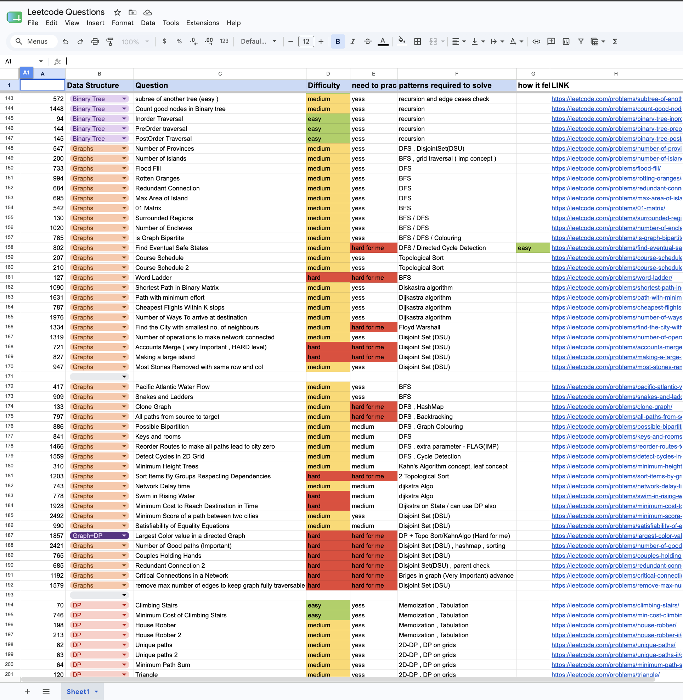
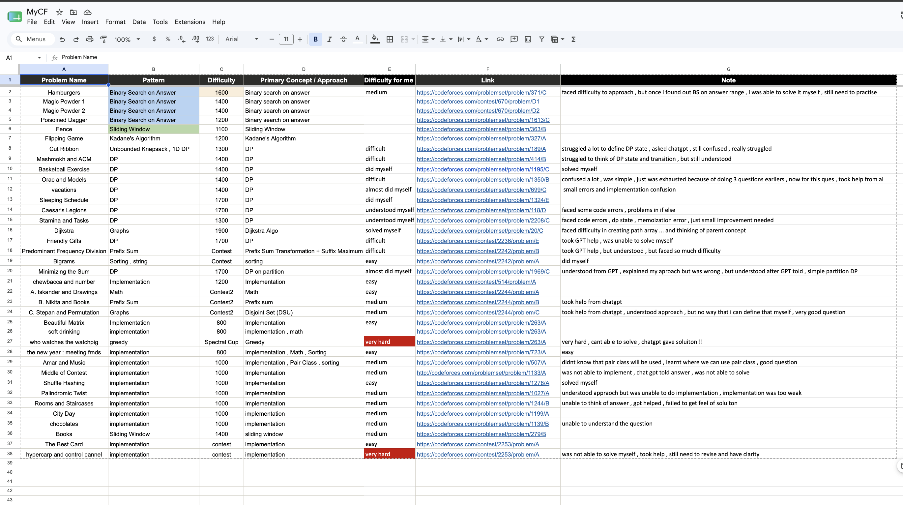

Welcome!
This repository contains my personal DSA tracking sheets that I maintain while solving problems on different coding platforms.

---
## 📚 DSA Sheets

| Platform | Open |
|----------|------|
| 🚀 LeetCode | [📄 View Sheet](https://docs.google.com/spreadsheets/d/1lm-qW74M9h84IGH8-F67E3apfF1Wbr38sHf6j0REmkc/edit?pli=1&gid=0#gid=0) |
| 📘 GeeksForGeeks | [📄 View Sheet](https://docs.google.com/spreadsheets/d/14No8UPBy2CtaMhvlhJ4x7nN_cKwAJdj9WkVuwXOXLn4/edit?gid=0#gid=0) |
| ⚔️ Codeforces | [📄 View Sheet](https://docs.google.com/spreadsheets/d/1VQl2Q9FHMsXNV-sxT7OA2LMm5rWMrCouWsT-XHWE8Uo/edit?gid=0#gid=0) |
---

Instead of only marking questions as solved, I also record:

- 📌 Pattern used
- 📈 Difficulty
- 🧠 Core concept required
- 📝 Personal observations
- 🔗 Direct problem links

#The goal is to make revision easier and help others preparing for coding interviews and competitive programming.

## ⭐ About

These sheets are my personal learning notes created while solving problems.

They are continuously updated as I learn new concepts and solve more questions.

If you find them useful, consider starring ⭐ this repository.

  

  

